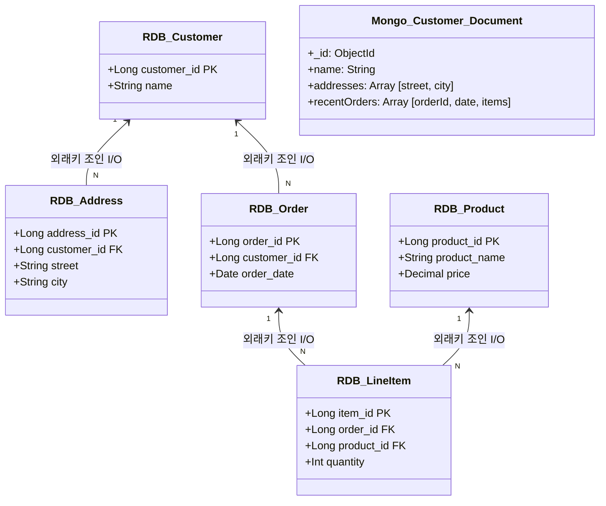
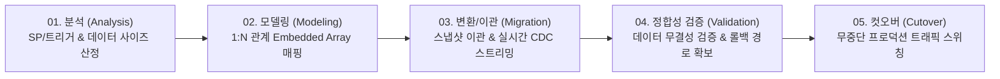
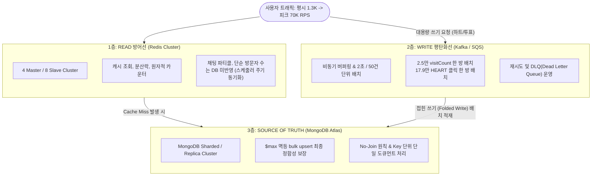
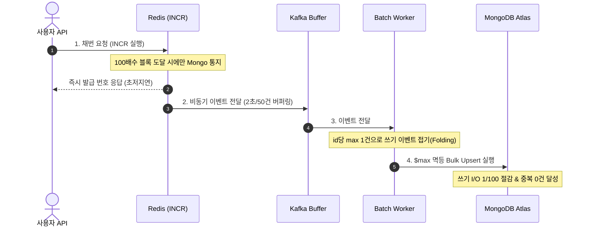
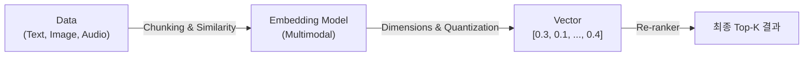
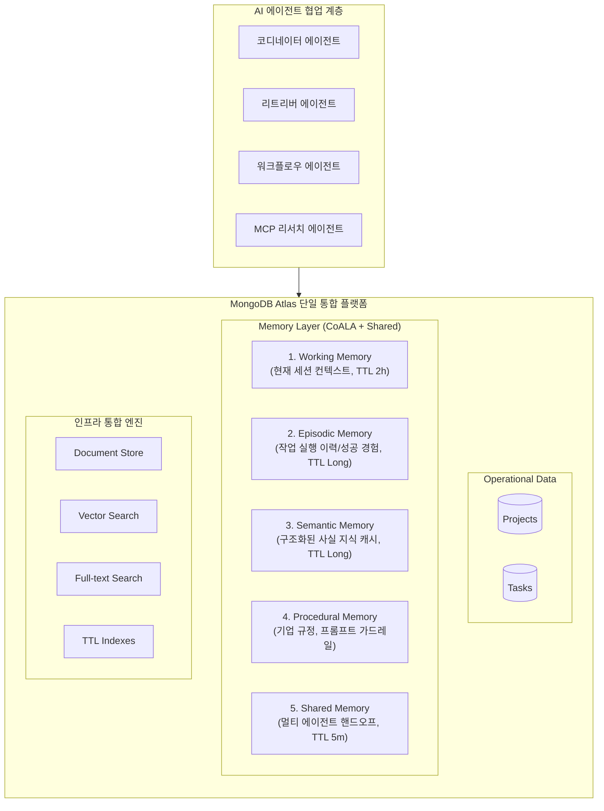
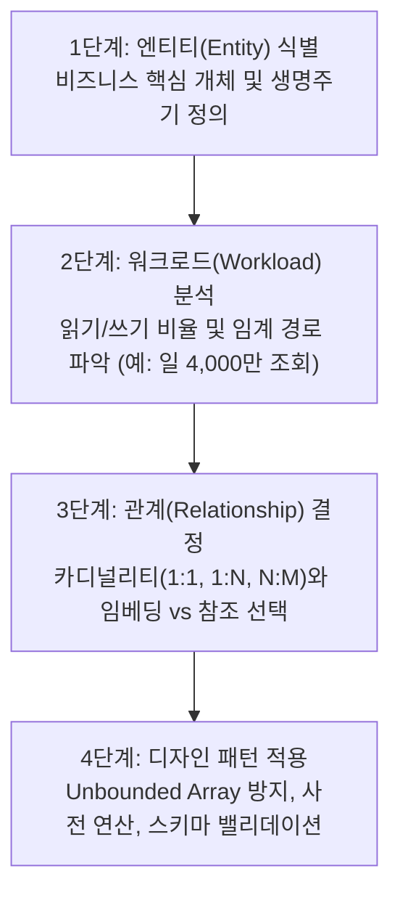
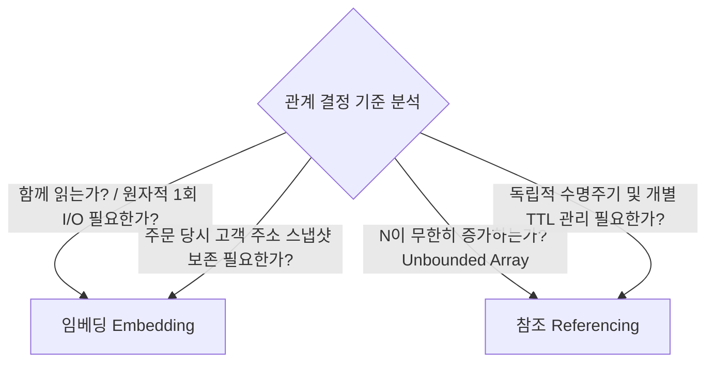
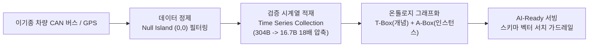
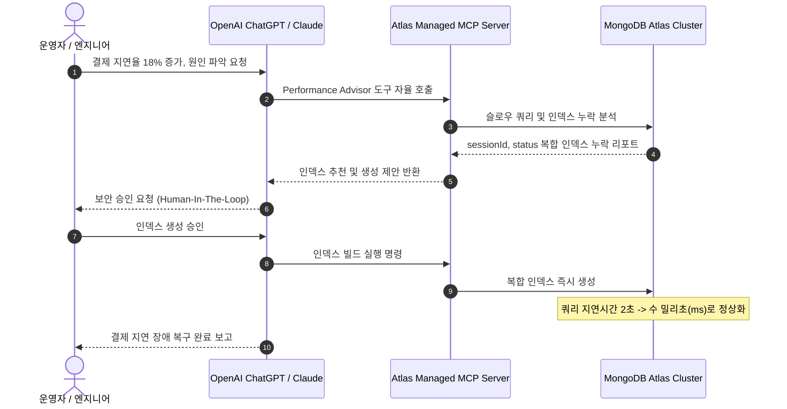

# MongoDB.local Seoul 2026

## [세션 1] RDBMS에서 NoSQL(MongoDB)로 전환하는 엔터프라이즈 과제

* **연사**: 류수미 (Open 신어 솔루션즈 아키텍트, 17년 차 DB 엔지니어)
* **주요 의제**: RDBMS의 역사적 한계 극복, I/O 최적화 모델링, Relational Migrator 5단계 실무 마이그레이션

### 1. 패러다임 변화 배경 및 I/O 중심 철학

* **1970~1980년대 (RDBMS 태동기)**:
  * 스토리지 디스크 하드웨어가 극도로 고가였던 시절 개발 (Oracle 1979년, PostgreSQL 1990년, MySQL 1995년).
  * 에드가 커드(Edgar F. Codd) 박사의 정규화(Normalization) 이론은 데이터 중복을 최소화하여 비싼 디스크 공간을 아끼는 데 최우선 목표를 둠.
  * 소수 사내 사용자 중심의 B2B 시스템, 정기 점검 시간(야간/주말 다운타임) 허용.
* **현대 분산 클라우드 환경**:
  * AWS S3(2006년), 스마트폰 및 MongoDB 커밋(2007년) 이후 스토리지 비용이 급락하고 24/7 무중단 글로벌 트래픽 급증.
  * DBMS 성능 저하의 주원인은 CPU 연산이 아니라 **다중 테이블 JOIN에 따른 디스크 및 네트워크 블록 I/O 병목(I/O-Bound)**.
  * **"함께 조회되는 데이터는 함께 저장한다"**는 역정규화(Denormalization) 원칙 하에 단일 도큐먼트에 관련 엔티티를 내장(Embedding)하여 1회의 I/O로 조회 완결.
* **MySQL Instant DDL vs MongoDB 스키마 유연성**:
  * MySQL 등 관계형 DB의 온라인 DDL은 변경 횟수 제한(64회 등) 및 락 리스크 존재.
  * MongoDB는 동일 컬렉션 내에서 자유로운 필드 확장과 무중단 애플리케이션 진화 가능.

### 2. 관계형 조인 모델 vs 도큐먼트 내장 모델 구조 비교

### 3. Relational Migrator를 활용한 5단계 이관 전략

- **MySQL world 샘플 라이브 데모**:
    
      
    - MySQL 8.4 로컬 인스턴스에서 239건의 `country` 테이블과 1:N 관계인 `city`, `countrylanguage` 테이블을 소스로 지정.
        
          
        
    - Relational Migrator GUI 상에서 불필요한 외래키(`country_code`)는 언체크(Uncheck)하여 제거.
        
          
        
    - Atlas 타깃 컬렉션의 하위 배열(Array)로 자동 매핑 후 무중단 일괄 마이그레이션 완결.
        
          
        

## [세션 2] Mplus의 전담 DBA 없는 대규모 글로벌 서비스 운영기

- **연사**: 정희성, 남재우 (Mplus 엔지니어링팀)
    
      
    
- **주요 의제**: 글로벌 4,500만 가입자 운영, 3계층 트래픽 방어선, 한정판 채번 1/100 최적화, 롤링 업데이트 장애 극복
    
      
    

### 1. 3계층 트래픽 방어선 (피크 70K RPS 대응)

대형 방송 이벤트(MAMA, 보이즈 플래닛 등) 발생 시 평소 1.3K RPS에서 최대 **70K RPS 이상**으로 트래픽이 50배 이상 폭증하는 환경을 전담 DBA 없이 35명의 개발팀이 방어하는 구조입니다.

  

### 2. 3세대 채번기: 한정판 포토카드 Mongo 쓰기량 1/100 최적화

- **초기 장애 배경**: 과거 단일 도큐먼트의 `$inc` 연산에 의존하고 트랜잭션 범위를 비효율적으로 잡아 락 경합 및 대규모 포인트 환불/재지급 사태 발생.
    
      
    
- **4중 평탄화 메커니즘**:
    
      
    

### 3. 정기 업데이트 및 클러스터 관리 실무 트러블슈팅

- **롤링 업데이트 무중단 대응**:
    
      
    - Replica Set의 Secondary 2대를 순차 업데이트 후, 마지막 Primary 노드가 Stepdown(재선출)되는 수초~수십초간 트랜잭션 실패(StateConfig 13388) 발생.
        
          
        
    - 단순 조회 요청은 프론트엔드 클라이언트 재시도(Exponential Backoff) 유도.
        
          
        
    - 결제 등 주요 트랜잭션은 DLT(Dead Letter Topic)로 격리 전송 후 백그라운드 **분산 보상 트랜잭션** 배치로 최종 완결.
        
          
        
- **스냅샷 부분 복구 장애 사례**:
    
      
    - Compass GUI 실수로 테스트 데이터 외 컬렉션이 전체 삭제되었을 때, 전체 Snapshot Restore를 수행하면 그사이 결제된 정상 데이터가 유실됨.
        
          
        
    - **해결책**: 스냅샷 파일을 다운로드하여 별도의 임시 Atlas 인스턴스에 적재한 뒤, 삭제된 컬렉션만 선별 추출하여 운영 DB로 이관. 이후 Querypie 결재 체계 강제 도입.
        
          
        

## [세션 3] 생성형 AI 시대를 위한 효율적인 벡터 검색 및 임베딩 전략

- **주요 의제**: 고차원 벡터의 메모리 및 레이턴시 병목 극복, 5단계 임베딩 파이프라인, MRL 차원 절삭, 양자화
    
      
    

### 1. 임베딩 파이프라인 5단계 흐름도

### 2. 5대 핵심 고려 사항 세부 기술 요점

|**단계**|**기술 요소**|**핵심 원리 및 실무 효과**|
|---|---|---|
|**01. Chunking**|Contextual Chunking (Voyage AI)|단순 오버랩 방식이나 매 청크마다 LLM을 재호출하는 비효율을 배제. 동일 문서의 청크들을 배열(Array)로 묶어 컨텍스트를 보존한 채 임베딩하여 문맥 유실 방지.|
|**02. Similarity**|유사도 메트릭 선정|**Cosine**: 텍스트 의미 각도 측정 (RAG 표준)         **Dot Product**: 벡터 크기(Norm)와 가중치 중요 시 채택         **Euclidean (L2)**: 이미지 공간 절대 거리 측정|
|**03. Dimension**|Matryoshka Representation Learning (MRL)|전면부 차원에 중요 정보가 집약되도록 사전 학습된 모델. 별도 재임베딩 비용 없이 상위 차원만 단순 Truncate(절삭)하여 1024차원 -> 256차원으로 즉시 경량화.|
|**04. Quantize**|스칼라 및 바이너리 양자화|FP32(32비트) 벡터 원본은 도큐먼트에 보관하고, Atlas Search 인덱스만 INT8(스칼라) 또는 1비트(바이너리)로 압축하여 RAM 사용량 75~96% 절감.|
|**05. Reranker**|2단계 파이프라인|1차로 경량 하이브리드 서치를 통해 Top-100 후보를 빠르게 필터링한 후, 2차 Cross-Encoder Re-ranker로 최종 정확도 보정.|

## [세션 4] 에이전트 메모리 시스템: 지속성 메모리를 갖춘 자율형 AI 구축

- **연사**: 조권 (MongoDB 수석 솔루션 아키텍트)
    
      
    
- **주요 의제**: MIT 엔터프라이즈 AI 연구 분석, CoALA 기반 5계층 인지 메모리, 도구 내재화 및 선택적 망각
    
      
    

### 1. MIT 연구 분석과 AI 패러다임 전환

- **AI 양극화**: 2025년 MIT 연구에 따르면 기업 AI 프로젝트의 **95%가 실질적 손익(P&L) 개선에 실패**.
    
      
    
- **실패 원인**: LLM 모델 자체의 한계가 아니라, 과거 피드백과 사용자 선호도를 기억하지 못하는 휘발성 구조 때문.
    
      
    
- **해법**: 단순 일회성 문답(RAG)을 넘어 장기 지속성 메모리(Persistent Memory)를 갖춘 자율형 에이전트 AI로 전환.
    
      
    

### 2. CoALA 인간 인지 모델 기반 5계층 메모리 아키텍처

### 3. 에이전트 최적화 핵심 전략

- **컨텍스트 엔지니어링**: RAG 검색 결과를 메인 LLM에 전달하기 전 SLM(경량 언어 모델)으로 사전 요약·압축하여 토큰 소모량 40~60% 절감.
    
      
    
- **선택적 망각 (TTL Index)**: 수명이 다한 워킹/에피소딕 메모리는 TTL 인덱스로 자동 소멸시켜 컨텍스트 오염 및 환각(Hallucination) 원천 차단.
    
      
    
- **도구 내재화**: 외부 MCP 도구(Tavily 등) 호출 패턴을 추적하여 자주 발생하는 질의를 MongoDB 내부 빌트인 커맨드로 자동 승격.
    
      
    

## [세션 5] 워크로드 중심의 MongoDB 데이터 모델링 및 디자인 패턴

- **연사**: 방선구, 강승욱 (MongoDB 수석 솔루션 아키텍트)
    
      
    
- **주요 의제**: 워크로드 중심 4단계 모델링, 임베딩 vs 참조 의사결정 매트릭스, 디자인 패턴 패밀리 5대 분류, 스키마 검증
    
      
    

### 1. 워크로드 중심 4단계 모델링 방법론

### 2. 엔티티 범주 매핑 및 임베딩 vs 참조 체크리스트

- **확장 참조 패턴 (Extended Reference Pattern)**:
    
      
    - 주문 내역 전체를 고객 문서에 내장하면 문서가 16MB 한계에 도달하거나 과도한 메모리 대역폭 소모.
        
          
        
    - 전체 주문은 참조 컬렉션으로 분리하되, 마이페이지 첫 화면 조회에 필요한 "최신 3건 주문 요약(orderId, date, total)"만 고객 문서에 복제 내장하여 메인 화면 조회 I/O를 1회로 단축.
        
          
        
- **계산 패턴 (Computed Pattern)**:
    
      
    - 조회 시점마다 리뷰 목록을 `AVG()`, `COUNT()`로 집계하지 않고, 리뷰 작성 시점에 `numberReviews`, `totalStars`, `averageRating`을 사전 계산하여 제품 문서에 기록.
        
          
        
- **스키마 검증 (Schema Validation)**:
    
      
    - 유연한 스키마를 지원하면서도 프로덕션 필수 필드 누락 방지를 위해 DB 엔진 레벨에서 `$jsonSchema` 유효성 검사 규칙 적용.
        
          
        

## [세션 6] 엔터프라이즈 IoT 및 금융(결제) 도메인의 AI-Ready 데이터 전환

- **연사**:
    
      
    - 세션 A: 김명국, 이승범 (유모스원 FMS 개발팀 & 데이터 엔지니어)
        
          
        
    - 세션 B: 이태현 (BC카드 AI 기술팀)
        
          
        
- **주요 의제**: FMS 시계열 18배 압축, 온톨로지 Graph RAG, 단일 플랫폼 통합 쿼리 가속
    
      
    

### 1. 차량 IoT의 AI-Ready 파이프라인 (유모스원)

- **시계열 저장 구조 진화**:
    
      
    - 과거 `trip.points[]` 단일 배열 적재 방식은 문서 16MB 초과 위험 및 빈번한 디스크 재할당 발생.
        
          
        
    - 센서당 1개 문서 적재 방식은 건당 304B로 스토리지 및 인덱스 낭비 심화.
        
          
        
    - **MongoDB Time Series Collection** 도입: 메타필드(차량 ID)와 시간 단위 버킷(`granularity: seconds`)을 지정하여 **건당 16.7B로 18배 이상 압축** 달성.
        
          
        
- **온톨로지 기반 지식 질의 매핑 (Graph RAG)**:
    
      
    - "지난 3개월간 강남구를 운전한 드라이버 중 안전점수 상위 5명은?" 질의 시, RDB의 다중 조인(4회)을 온톨로지 관계 탐색 1회로 해소.
        
          
        
    - LLM이 MQL/SQL을 직접 생성할 때 스키마 벡터 서치를 가드레일로 제공하여 쿼리 환각 원천 방어.
        
          
        

### 2. 금융 결제 데이터의 AI 에이전트 확장 (BC카드)

- **정형 + 비정형 결제 데이터 결합**: 45년간 축적된 정형 결제 승인 데이터(누가, 언제, 어디서, 얼마)에 외부 리뷰 및 가맹점 비정형 데이터를 결합.
    
      
    
- **다중 네트워크 왕복(RTT) 문제 해결**:
    
      
    - 기존 파이프라인(임베딩 모델 -> 벡터 DB -> 키워드 DB -> 리랭킹 API)의 3~4회 왕복 지연을 단일 MongoDB Atlas 엔진으로 통합.
        
          
        
    - BM25 텍스트 서치 + 벡터 서치 + `$rank` 어그리게이션을 단일 쿼리로 처리하여 **PostgreSQL + pgvector 대비 응답 속도 53.6% 개선**.
        
          
        

## [세션 7] Model Context Protocol(MCP)과 Voyage AI 통합 자동화

- **연사**: Chris, Craig, Frank (MongoDB 솔루션 팀)
    
      
    
- **주요 의제**: 관리형 Atlas MCP 서버, 장애 트리아지(Triage) 라이브 데모, 자동 임베딩
    
      
    

### 1. Atlas Managed MCP Server 운영 자동화 워크플로우

## 종합 요약 및 핵심 테이크어웨이

1. **현대 데이터 모델링의 핵심**: 디스크 용량을 아끼는 정규화 시대에서, **네트워크/디스크 I/O를 1회로 줄이는 도큐먼트 내장 및 역정규화 시대**로 완전히 전환되었습니다.
    
      
    
2. **운영 효율의 극대화**: 전담 DBA가 없더라도 In-Memory 캐시(Redis), 비동기 큐(Kafka), MongoDB Atlas의 3계층 방어를 통해 70K RPS 이상의 극한 트래픽을 완벽히 소화할 수 있습니다.
    
      
    
3. **AI-Ready 인프라 통합**: 분산된 벡터 DB, 전문 검색 엔진, 캐시를 따로 운영할 필요 없이, MongoDB Atlas 단일 플랫폼 내에서 Operational Data, CoALA 5계층 메모리, 벡터 검색, 시계열 압축을 통합 구현하는 것이 엔터프라이즈 AI의 성공 경로입니다.

---

## 📚 주요 기술 용어 상세 해설 (Glossary)

회의록 및 발표자료에 등장하는 핵심 기술 용어들을 도메인별로 분류하여 상세히 설명합니다.

### 1. 데이터베이스 모델링 및 아키텍처 (Database & Modeling)

* **정규화(Normalization) vs 역정규화(Denormalization / Embedding)**
  * **정규화**: 중복 데이터를 최소화하여 무결성을 유지하고 저장 공간을 절약하는 전통적 RDBMS 설계 기법 (제1~3정규형 등). 디스크 하드웨어가 고가이던 시절 필수적이었으나, 조회 시 빈번한 `JOIN` 연산으로 인해 I/O 병목이 발생합니다.
  * **역정규화 (도큐먼트 임베딩)**: "함께 읽히는 데이터는 함께 저장한다"는 원칙에 따라 연관 데이터를 단일 도큐먼트 내 하위 객체나 배열로 내장(Embedding)하는 기법입니다. 단 1회의 디스크/네트워크 블록 I/O로 복합 조회가 완결되도록 최적화합니다.

* **I/O-Bound (입출력 병목)**
  * 시스템 성능의 한계가 CPU 연산 처리 속도가 아니라 디스크 읽기/쓰기 속도나 네트워크 데이터 전송 대역폭에 의해 결정되는 상태를 의미합니다. 현대 클라우드 분산 환경에서는 CPU보다 스토리지 I/O 비용 및 네트워크 지연이 주요 성능 병목 지점이 됩니다.

* **확장 참조 패턴 (Extended Reference Pattern)**
  * 1:N 또는 N:M 관계에서 모든 세부 데이터를 내장할 경우 도큐먼트 크기가 비대해지는 문제를 해결하기 위한 디자인 패턴입니다. 전체 데이터는 별도 참조(Reference) 컬렉션으로 분리하되, 메인 화면이나 목록 조회 시 가장 빈번하게 필요한 핵심 필드(예: 최근 주문 3건의 ID, 날짜, 금액)만 부모 도큐먼트에 복제 내장하여 I/O 효율을 극대화합니다.

* **계산 패턴 (Computed Pattern)**
  * 조회 요청마다 `SUM()`, `AVG()`, `COUNT()` 등의 집계 연산을 반복 수행하는 대신, 데이터가 생성되거나 수정되는 시점에 사전 연산(Pre-computation)하여 결과값을 도큐먼트 필드에 저장하는 패턴입니다. 읽기 워크로드의 CPU 소모와 쿼리 응답 시간을 대폭 단축시킵니다.

* **Unbounded Array (무제한 배열 방지)**
  * 도큐먼트 내의 배열 필드가 비즈니스 로직 상 상한선 없이 무한정 증가하는 구조를 의미합니다. MongoDB의 단일 도큐먼트 최대 크기(16MB) 제한에 도달할 위험이 있고, 잦은 메모리 재할당과 단편화를 유발하므로 버킷 패턴(Bucket Pattern)이나 참조 모델로 분리 설계해야 합니다.

* **CDC (Change Data Capture)**
  * 원천 데이터베이스의 트랜잭션 로그(MySQL의 Binlog, MongoDB의 Oplog 등)를 실시간 감지하여, 발생한 데이터 변경 사항(C/U/D)을 타깃 시스템으로 지연 없이 스트리밍 동기화하는 기술입니다. 마이그레이션 도구(Relational Migrator)에서 무중단 실시간 이관을 구현하는 기반 기술입니다.

* **MongoDB Time Series Collection**
  * 센서, IoT, 금융 시세 등 시간 순서대로 발생하는 대규모 시계열 데이터를 위해 최적화된 전용 컬렉션입니다. 메타데이터(기기 ID 등)와 타임스탬프를 기준으로 데이터를 내부 버킷 단위로 묶고 고효율 압축 알고리즘을 적용하여 일반 도큐먼트 대비 **18배 이상의 압축률과 빠른 범위 질의 성능**을 제공합니다.

---

### 2. 대규모 트래픽 분산 엔지니어링 (High-Traffic Engineering)

* **3계층 트래픽 방어선 (Redis - Kafka - MongoDB)**
  * 극한 트래픽(피크 70K RPS 이상)으로부터 데이터베이스를 보호하기 위해 구축한 계층형 아키텍처입니다:
    * **1층 (READ 방어선)**: Redis Cluster를 통해 캐시 조회, 분산락, 원자적 카운터를 처리하여 불필요한 DB 조회를 차단.
    * **2층 (WRITE 평탄화선)**: Kafka / SQS 비동기 버퍼를 두어 순간적으로 쏟아지는 대량의 쓰기 이벤트를 흡수하고 배치(Batch)로 평탄화.
    * **3층 (Source of Truth)**: 최종 검증된 정합성 데이터만을 안전하고 영구적으로 적재하는 MongoDB Atlas 클러스터.

* **접힌 쓰기 (Folded Write / Event Folding)**
  * 단시간 내에 동일한 엔티티를 대상으로 발생하는 대량의 갱신 이벤트(예: 17만 건의 하트 클릭, 조회수 증가 등)를 배치 워커 메모리 상에서 ID 단위로 최종 상태 1건으로 병합(Folding)하여 DB에 단일 업데이트로 실행하는 기법입니다. 데이터베이스 쓰기 I/O를 1/100 수준으로 획기적으로 절감합니다.

* **멱등성 및 $max 벌크 업서트 ($max Idempotent Bulk Upsert)**
  * **멱등성(Idempotence)**: 동일한 연산을 여러 번 실행하더라도 최종 결과가 한 번 실행했을 때와 동일하게 유지되는 성질입니다.
  * 네트워크 재시도나 중복 메시지 유입 시 데이터가 오염되지 않도록, `$max` 연산자를 활용하여 기존 값보다 큰(최신) 값으로만 갱신되도록 보장하는 벌크 업서트(`upsert`) 쿼리 패턴입니다.

* **Primary Stepdown (프라이머리 재선출)**
  * MongoDB 복제셋(Replica Set)에서 무중단 롤링 패치나 장애 조치 시, 활성 Primary 노드가 Secondary 노드로 역할을 내려놓고 새로운 Primary를 선출하는 일련의 과정입니다. 이 전환기(수 초~수십 초) 동안 일시적인 쓰기 실패가 발생할 수 있어 클라이언트의 지수 백오프(Exponential Backoff) 및 비동기 보상 트랜잭션 설계가 필수적입니다.

* **DLT / DLQ (Dead Letter Topic / Queue)**
  * 비즈니스 로직 오류, DB 다운타임 등으로 인해 정상적으로 처리되지 못하고 재시도 횟수를 초과한 실패 메시지를 별도로 격리 보관하는 전용 토픽/큐입니다. 전체 메시지 파이프라인의 병목을 방지하고 추후 원인 분석 및 수동/자동 재처리를 가능하게 합니다.

---

### 3. AI, 벡터 검색 및 지식 검색 (AI & Vector Search / RAG)

* **Contextual Chunking (문맥 보존 청킹)**
  * 문서를 기계적으로 고정 글자 수 단위로 분할할 때 문맥이 끊기는 문제를 해결하는 기법입니다. 상위 문서의 제목, 주제, 전후 맥락 요약 정보를 각 청크의 헤더나 메타데이터로 함께 포함하여 임베딩함으로써 검색 정확도를 극대화합니다.

* **벡터 유사도 메트릭 (Similarity Metrics)**
  * **Cosine Similarity (코사인 유사도)**: 두 벡터 간의 사잇각(방향성)을 측정하여 텍스트 간 의미론적 유사도를 비교하는 표준 메트릭 (벡터 길이에 영향받지 않음).
  * **Dot Product (내적)**: 벡터의 방향뿐 아니라 크기(중요도 가중치)까지 반영해야 할 때 채택.
  * **Euclidean Distance (L2 거리)**: 다차원 공간에서의 절대적 기하학적 직선 거리를 측정하며, 이미지 임베딩 등에서 주로 활용.

* **MRL (Matryoshka Representation Learning, 마트료시카 표현 학습)**
  * 러시아 인형(마트료시카)처럼 벡터의 전면부 차원에 핵심 의미 정보가 고밀도로 응축되도록 학습시킨 임베딩 모델 기법입니다. 1024차원 벡터의 상위 256차원만 잘라내어(Truncate) 사용하더라도 정확도 손실을 최소화하면서 연산 속도와 인덱스 메모리를 대폭 절약할 수 있습니다.

* **벡터 양자화 (Vector Quantization: Scalar & Binary)**
  * 32비트 부동소수점(FP32)으로 표현된 고차원 벡터를 8비트 정수(INT8, 스칼라 양자화) 또는 1비트(0/1, 바이너리 양자화)로 압축 변환하는 기술입니다. Atlas Vector Search에서 인덱스 크기와 RAM 점유율을 **75%~96% 절감**시키며 검색 처리 속도를 비약적으로 향상시킵니다.

* **Re-ranker (Cross-Encoder 재정렬기)**
  * 1단계에서 벡터 검색(Bi-Encoder) 또는 하이브리드 검색으로 빠르게 Top-K 후보군(예: 100건)을 추출한 뒤, 2단계에서 질문과 문서를 동시에 입력받아 심층 상호작용을 계산하는 고정밀 모델(Cross-Encoder)을 통해 최종 연관도 순위를 재정렬하는 2단계 파이프라인입니다.

* **온톨로지 Graph RAG (T-Box & A-Box)**
  * **T-Box (Terminological Box)**: 개념, 클래스, 관계의 정의 등 도메인의 논리적 지식 스키마.
  * **A-Box (Assertional Box)**: 실제 특정 개체(차량, 드라이버, 결제 건 등) 인스턴스와 구체적 사실 데이터.
  * 관계형 테이블의 4~5중 다단계 JOIN 질의를 온톨로지 지식 그래프 탐색으로 1회에 해결하고, LLM이 잘못된 쿼리를 생성하지 않도록 스키마 가드레일을 제공하는 차세대 RAG 아키텍처입니다.

---

### 4. 자율형 AI 에이전트 및 거버넌스 (Agent & Governance)

* **CoALA (Cognitive Architectures for Language Agents)**
  * LLM 기반 자율형 에이전트의 구조를 체계화한 인지 아키텍처 프레임워크입니다. 인간의 인지 과정을 모방하여 메모리, 의사결정 사이클, 도구 사용을 구조화합니다:
    * **Working Memory**: 현재 세션의 즉각적인 대화 컨텍스트.
    * **Episodic Memory**: 과거 작업 수행 이력, 성공/실패 경험.
    * **Semantic Memory**: 장기 사실 지식, 세계관, 도메인 캐시.
    * **Procedural Memory**: 행동 규칙, 프롬프트 가이드라인, 기업 정책.
    * **Shared Memory**: 다중 에이전트 협업 시 상태 및 작업 인계(Handoff)를 위한 공유 메모리.

* **TTL Index (Time-To-Live / 선택적 망각)**
  * 지정된 유효 기간이 만료된 도큐먼트를 백그라운드 스레드가 자동으로 삭제하는 인덱스입니다. 에이전트 시스템에서 오래된 대화나 불필요한 단기 기억을 자동으로 소멸시켜 컨텍스트 윈도우 오염과 모델 환각(Hallucination)을 원천 차단하는 '선택적 망각' 메커니즘으로 활용됩니다.

* **MCP (Model Context Protocol)**
  * Anthropic이 주도하고 업계 표준으로 채택되고 있는 프로토콜로, LLM 애플리케이션이 기업 내부 데이터베이스, 개발 도구, API와 표준화된 인터페이스(JSON-RPC 기반)를 통해 안전하게 상호작용할 수 있도록 돕는 개방형 프로토콜입니다.

* **Human-In-The-Loop (HITL)**
  * AI 에이전트가 문제를 진단하고 해결책을 자율적으로 제시하더라도, 인덱스 생성, DB 스키마 변경, 금융 결제 승인과 같이 고위험·고영향을 미치는 최종 실행 단계에서는 반드시 운영자의 확인 및 보안 승인을 거치도록 하는 통제 거버넌스 설계입니다.
